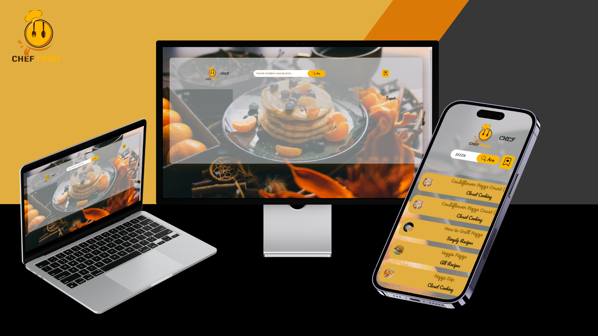
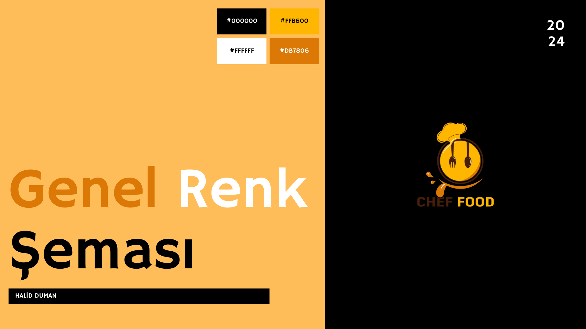

# Restaurant-website

**LOGO:**

**Başlık:** CHEF FOOD

**Açıklama:** Bu proje, bir web sitesinin temel işlevlerini gerçekleştirmek için JavaScript ağırlıklı bir yapı kullanır. Temel olarak, kullanıcıların belirli bir konuya ilişkin bilgi aramasına olanak tanır.

**Genel Görsel:**

**Temel Bilgiler:**

* **Tasarım:** Sitemiz responsive bir tasarıma sahip ve tek sayfadan oluşuyor.
* **Renk Paleti:** turuncu yoğunluklu renk kullanılmıştır.

**Özellikler**

Kullanıcılar arama kutusuna bir anahtar kelime girerek arama yapabilir.
Arama sonuçları, kullanıcının isteğine göre filtrelenir ve gösterilir.
Arama sonuçları, dinamik olarak JavaScript tarafından oluşturulan ve güncellenen bir liste şeklinde sunulur.

* **Kullanılan Teknolojiler:**
    * HTML
    * CSS
    * JavaScript

# Responsive
 

# Renkler

 

